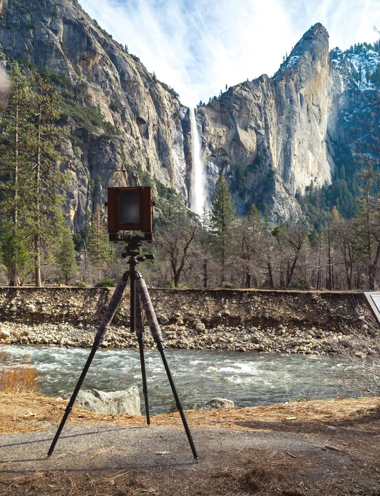

# ⚡ AI-Based Image & Video Compression System

> **Content-adaptive AI compression for images and videos using feature extraction, Machine Learning, automated quality evaluation, and iterative parameter adjustment.**

An intelligent, content-adaptive media compression system that analyzes visual characteristics (texture, sharpness, motion, and entropy) using Computer Vision and Machine Learning (`RandomForestRegressor`) to predict optimal compression parameters for each file.

It preserves high visual quality while maximizing file-size reduction. The system includes an automatic quality-evaluation and retry-adjustment loop, and benchmarks results against traditional fixed-parameter compression methods.

---

## 🔬 Approach & Methodology

This project does **not** use a single fixed compression setting for all files. Instead, it follows a **data-driven, content-adaptive AI approach** by analyzing each file's unique visual content before deciding how it should be compressed.

### 🧩 Core Idea
> Traditional compressors apply the same quality level (e.g., `quality=75` or `CRF=23`) to every file regardless of its content. Our system **predicts the best compression parameter for each file** using Machine Learning, preserving quality while maximizing space savings.

---

### 🤖 Machine Learning Approach

| | Images | Videos |
|:---|:---|:---|
| **Algorithm** | `RandomForestRegressor` | `RandomForestRegressor` |
| **Predicts** | Optimal WebP quality (45–95) | Optimal H.264 CRF (18–34) |
| **Trained On** | **800 high-res images** (DIV2K Dataset) | **18 HD/1080p videos** (Pexels.com) |
| **Input Features** | Resolution (MP), Entropy, Edge Density, Color Variance, Laplacian Variance | Resolution (MP), FPS, Duration, Motion Magnitude, Edge Density, Entropy |
| **Target Label** | Minimum quality achieving SSIM ≥ 0.95 | Maximum CRF maintaining SSIM ≥ 0.95 |
| **Model File** | `models/image_quality_model.joblib` | `models/video_quality_model.joblib` |

---

### 📊 Training Data Collection — How We Generated Labels

Rather than manually labeling the data, we use **automated parameter sweeping**:

#### 📷 Image Training (800 Images — DIV2K Dataset)
1. Loaded 800 uncompressed 2K images from the **DIV2K `DIV2K_train_HR`** benchmark dataset.
2. For each image, extracted 5 visual features using **OpenCV + NumPy** (entropy, edge density, color variance, sharpness, resolution).
3. Swept WebP quality values `[30, 40, 50, 60, 70, 80, 90]` per image.
4. Computed **SSIM** (via scikit-image) for each quality level against the original.
5. Labeled each image with the **minimum quality that achieved SSIM ≥ 0.95** → saved to `data/image_training_data.csv` (800 rows × 10 columns).

#### 🎬 Video Training (18 Videos — Pexels.com)
1. Downloaded **18 diverse HD videos** from [Pexels.com](https://www.pexels.com/video/) covering 3 motion categories:
2. For each video, extracted 6 features: average frame entropy, edge density, optical flow motion magnitude (Farneback algorithm), resolution, FPS, and duration.
3. Swept H.264 CRF values `[18, 22, 26, 30, 34, 38, 42]` per video using FFmpeg.
4. Computed frame-averaged **SSIM** for each CRF level.
5. Labeled each video with the **maximum CRF that maintained SSIM ≥ 0.95** → saved to `data/video_training_data.csv` (18 rows × 11 columns).

---

### 🔁 Inference Pipeline — Per-File Compression Flow

```
Input File (Image / Video)
        │
        ▼
  Feature Extraction          ← OpenCV, NumPy, PIL (entropy, edges, motion, sharpness)
        │
        ▼
  ML Model Prediction         ← RandomForestRegressor predicts Quality / CRF
  (Fallback: Heuristic Rule)  ← Used if model not available
        │
        ▼
  Compression Engine          ← Pillow (WebP/JPEG) or FFmpeg (H.264/AAC)
        │
        ▼
  Quality Evaluation          ← SSIM + PSNR (scikit-image) + VMAF (FFmpeg libvmaf)
        │
   SSIM ≥ 0.95?
    ├── YES ✅ → Final Output + Download
    └── NO  ❌ → Auto-Adjust (raise quality / lower CRF) → Re-compress (max 3 retries)
```

---

### ⚖️ Why This Beats Traditional Compression

| Metric | Traditional (Fixed Params) | Our AI Approach |
|:---|:---:|:---:|
| Compression parameter | Same for all files | **Per-file, content-adaptive** |
| Quality guarantee | ❌ None | ✅ SSIM ≥ 0.95 enforced |
| Handles diverse content | ❌ Poor | ✅ Trained on 800 images + 18 videos |
| Auto-corrects bad output | ❌ No | ✅ 3-iteration adjustment loop |
| Perceptual quality metric | ❌ No | ✅ SSIM, PSNR, VMAF |

---

## 🧠 Training Datasets & Artifacts Used

The machine learning models in this project were trained on diverse media datasets using automated feature extraction and parameter sweeping:

### 1. Image Model Training Dataset
* **Source Dataset**: **DIV2K Dataset (`DIV2K_train_HR`)** - 800 high-resolution uncompressed 2K images (`0001.png` to `0800.png`) containing landscapes, architecture, human portraits, textures, and text.
* **Dataset Download Link**: [ETH Zurich DIV2K Dataset](https://data.vision.ee.ethz.ch/cvl/DIV2K/) | [Kaggle DIV2K Dataset](https://www.kaggle.com/datasets/joe1995/div2k-dataset)
* **Feature Sweeping**: Swept WebP quality levels (30, 40, 50, 60, 70, 80, 90) to find the minimum quality parameter achieving target SSIM `>= 0.95`.
* **Generated Dataset Artifact**: `data/image_training_data.csv` (800 labeled rows x 10 features: `resolution_mp`, `entropy`, `edge_density`, `color_variance`, `laplacian_variance`, `optimal_quality`).
* **Trained ML Artifact**: `models/image_quality_model.joblib` (RandomForestRegressor model).

### 2. Video Model Training Dataset
* **Source Dataset**: **18 High-Resolution HD/1080p Videos Downloaded from [Pexels.com](https://www.pexels.com/video/)** - Downloaded 18 large HD videos covering diverse motion categories (low motion screen recordings, medium motion vlogs/nature, and high motion sports/action scenes).
* **Feature Sweeping**: Swept H.264 CRF values (18, 22, 26, 30, 34, 38, 42) to find maximum CRF maintaining target SSIM `>= 0.95`.
* **Generated Dataset Artifact**: `data/video_training_data.csv` (18 labeled rows x 11 features: `resolution_mp`, `fps`, `duration_sec`, `avg_motion_magnitude`, `avg_edge_density`, `avg_entropy`, `optimal_crf`).
---

## 📁 Project Directory Structure

```
ai_compression_system/
├── README.md                      # Complete project documentation & setup guide
├── SETUP_PLAN.md                  # Deployment plan for new systems
├── requirements.txt               # Required Python dependencies
├── pyproject.toml                 # Project metadata configuration
├── app.py                         # Interactive Streamlit Web Application UI
├── src/                           # Core source code package
│   ├── __init__.py                # Package initializer
│   ├── image_features.py          # OpenCV image entropy, sharpness & edge density extraction
│   ├── video_features.py          # OpenCV video optical flow & motion features extraction
│   ├── image_compressor.py        # Pillow WebP / JPEG image compression engine
│   ├── video_compressor.py        # FFmpeg H.264 video compression engine
│   ├── quality_metrics.py         # SSIM, PSNR & VMAF evaluation engine
│   ├── ml_predictor.py            # RandomForestRegressor ML training & parameter serving
│   ├── generate_training_data.py  # Automated parameter sweeping & training CSV generator
│   ├── pipeline.py                # AI-assisted adaptive compression & auto-adjustment loop
│   ├── baseline.py                # Traditional fixed-parameter compression baseline
│   └── report.py                  # AI vs Baseline comparison report builder
├── Test_outputs/                  # Testing sample outputs (original & AI-compressed)
├── data/                          # Labeled training dataset CSV files
└── models/                        # Saved Machine Learning model binaries (.joblib)
```

---

## 🏗️ System Architecture

```
                       ┌─────────────────────────┐
     Image / Video ───►│    Feature Extractor    │  Extracts entropy, Canny edge density,
                       │ (OpenCV / NumPy / PIL)  │  Laplacian variance, Farneback optical flow
                       └────────────┬────────────┘
                                    │ Extracted Features
                       ┌────────────▼────────────┐
                       │  ML Parameter Predictor │  Predicts WebP Quality (45-95) or
                       │  (RandomForestRegressor)│  H.264 CRF (18-34). Fallback to Heuristic
                       └────────────┬────────────┘
                                    │ Predicted Parameters (Quality / CRF)
                       ┌────────────▼────────────┐
                       │   Compression Engine    │  Pillow (WebP/JPEG)
                       │    (FFmpeg / Pillow)    │  FFmpeg (H.264/AAC MP4)
                       └────────────┬────────────┘
                                    │ Compressed File
                       ┌────────────▼────────────┐
                       │    Quality Evaluator    │  Computes SSIM, PSNR (via scikit-image)
                       │ (scikit-image / FFmpeg) │  and VMAF (via FFmpeg libvmaf filter)
                       └────────────┬────────────┘
                                    │ Quality Score vs Target (SSIM >= 0.95)
                       ┌────────────▼────────────┐
                       │  Auto-Adjustment Loop   │  If SSIM < 0.95: adjusts parameter
                       │      (pipeline.py)      │  and re-compresses (max 3 iterations)
                       └────────────┬────────────┘
                                    │
                     Final Output, Metrics & Download
```

---

## 📦 Role of Dependencies & Libraries Used

| Library / Tool | Primary Role & Purpose in Project |
| :--- | :--- |
| **Python 3.10+** | Core programming language for logic, pipelines, and server execution. |
| **OpenCV (`opencv-python`)** | Image & video processing, frame extraction, Canny edge detection, Laplacian sharpness computation, and Farneback optical flow motion calculation. |
| **NumPy (`numpy`)** | Efficient array manipulation, histogram calculations, mathematical variance, and vector math. |
| **Pillow (`pillow`)** | High-performance image conversion and WebP/JPEG saving with custom quality parameters. |
| **FFmpeg (System Binary)** | Industry-standard backend video encoding (H.264/libx264, AAC audio) and faststart streaming optimization. |
| **scikit-learn (`scikit-learn`)** | Machine Learning engine (`RandomForestRegressor`, `train_test_split`, `mean_absolute_error`) for parameter prediction. |
| **scikit-image (`scikit-image`)** | Computes objective image quality metrics: SSIM (Structural Similarity Index) and PSNR (Peak Signal-to-Noise Ratio). |
| **Pandas (`pandas`)** | Managing tabular training datasets (`.csv`), data manipulation, and comparison report generation. |
| **Joblib (`joblib`)** | Persisting and loading binary machine learning models (`.joblib`). |
| **Streamlit (`streamlit`)** | Building the interactive web user interface dashboard with session caching and side-by-side comparison cards. |
| **Pytest (`pytest`)** | Automated unit testing framework for verifying feature extraction, compression functions, and pipelines. |

---

## ⚙️ Functionalities & Codebase Overview

### 1. Feature Extractors (`src/image_features.py` & `src/video_features.py`)
* `extract_image_features(image_path)`: Computes Shannon entropy (histogram texture), Canny edge density, color channel variance, Laplacian variance (sharpness), and resolution in megapixels.
* `extract_video_features(video_path)`: Samples frames across a video clip to compute average grayscale entropy, average edge density, and Farneback optical flow magnitude (`avg_motion_magnitude`) between consecutive frames.

### 2. Machine Learning Engine (`src/ml_predictor.py`)
* `train_image_model(df)`: Trains a `RandomForestRegressor` on image features to predict optimal WebP quality (bounded between 45 and 95).
* `train_video_model(df)`: Trains a `RandomForestRegressor` on video features to predict optimal H.264 CRF (bounded between 18 and 34).
* `predict_image_quality()` / `predict_video_crf()`: Predicts parameter using loaded model files (`.joblib`). If un-trained, uses a content-adaptive heuristic rule as fallback.

### 3. Compression Encoders (`src/image_compressor.py` & `src/video_compressor.py`)
* `compress_image(input_path, output_path, quality, fmt)`: Uses Pillow to encode image into WebP/JPEG with exact quality settings. Includes exception handling for invalid files.
* `compress_video(input_path, output_path, crf, codec, preset)`: Executes FFmpeg command using H.264 (`libx264`) with `-pix_fmt yuv420p` for universal web browser playback and `-movflags +faststart`.

### 4. Quality Evaluation Engine (`src/quality_metrics.py`)
* `evaluate_image_quality()`: Calculates SSIM (Structural Similarity Index) and PSNR.
* `evaluate_video_quality_ssim_psnr()`: Samples frames across compressed and original video to compute frame-averaged SSIM and PSNR.
* `evaluate_video_quality_vmaf()`: Uses FFmpeg's `libvmaf` filter if supported on system to calculate Netflix perceptual VMAF score (0-100).

---

## 🎯 Meaning & Role of Quality Evaluation & Auto-Adjustment Engine

### 1. Structural Similarity Index (SSIM)
* **Meaning**: SSIM is a perceptual metric that measures structural information loss, luminance, and contrast similarity between the original and compressed media on a scale of `0.0` to `1.0`.
* **Role in Project**: Serves as the **primary quality target threshold (`SSIM >= 0.95`)**. Unlike simple MSE, SSIM aligns closely with human eye perception. If compression introduces visual distortion, SSIM drops below 0.95, triggering the auto-adjustment system.

### 2. Peak Signal-to-Noise Ratio (PSNR)
* **Meaning**: PSNR measures the logarithmic ratio (in decibels, dB) between the maximum possible pixel signal power and the noise introduced by compression artifacts.
* **Role in Project**: Provides objective, mathematical pixel-level noise verification. Higher PSNR values (typically `35 dB - 50 dB`) indicate lower noise and higher fidelity.

### 3. Video Multi-Method Assessment Fusion (VMAF)
* **Meaning**: Developed by **Netflix**, VMAF is a Machine Learning-based perceptual quality metric (scaled `0` to `100`) that predicts how human viewers perceive video quality on screens.
* **Role in Project**: Evaluates perceptual video quality. A VMAF score of `90 - 100` signifies excellent quality where human eyes cannot spot compression degradation.

### 4. Automatic Parameter Adjustment Loop (`src/pipeline.py`)
* **Meaning**: A self-correcting closed-loop optimization algorithm (capped at 3 iterations).
* **Role in Project**: Guarantees output visual quality. If the ML model's initial prediction yields `SSIM < 0.95`, the loop automatically steps up quality (images) or lowers CRF (videos) and re-compresses until target quality is met.

---

### 5. Adaptive Pipeline & Auto-Adjustment (`src/pipeline.py`)
* `compress_image_adaptive()` / `compress_video_adaptive()`: Runs initial compression based on ML prediction. Evaluates output SSIM against target threshold (`0.95`). If quality is below target, dynamically lowers CRF / raises quality and re-compresses (up to 3 iterations).

### 6. Traditional Baseline Benchmark (`src/baseline.py`)
* `baseline_compress_image()` / `baseline_compress_video()`: Applies standard fixed compression parameters (Fixed Quality 75 for images, Fixed CRF 23 for videos) to provide a traditional benchmark.

### 7. Interactive Web Application (`app.py`)
* Built with Streamlit. Features drag-and-drop file upload, session_state caching (prevents re-executing compression on download click), side-by-side media preview, download buttons, MB/KB unit formatting, decision engine status, and comparison metrics cards.

---

## 🛠️ Step-by-Step Setup and Deployment Plan

### Step 1: Install System Dependencies (Python & FFmpeg)

#### **Linux (Ubuntu / Debian)**
```bash
sudo apt update
sudo apt install -y python3 python3-pip python3-venv ffmpeg
```

#### **macOS (Homebrew)**
```bash
brew install python ffmpeg
```

#### **Windows**
1. Download Python 3.10+ from [python.org](https://www.python.org/downloads/) (Check **"Add Python to PATH"**).
2. Download FFmpeg static build and add its `bin` directory to System PATH Environment Variables.

---

### Step 2: Set Up Virtual Environment & Dependencies

```bash
# 1. Enter project directory
cd ai_compression_system

# 2. Create virtual environment
python3 -m venv .venv

# 3. Activate virtual environment
# Linux/macOS:
source .venv/bin/activate
# Windows (cmd):
# .venv\Scripts\activate

# 4. Install Python dependencies
pip install --upgrade pip
pip install -r requirements.txt
```

---

### Step 3: Run the Application

Launch the Streamlit interactive dashboard:
```bash
python -m streamlit run app.py
```
Open `http://localhost:8501` in your browser to test images and videos.

---

## 🧪 Model Retraining & Demo Commands

### 1. Retrain Image Model (e.g. using DIV2K dataset)
```bash
# Step 1: Feature sweeping on custom images folder
python -m src.generate_training_data --images /path/to/your/image_folder --out-dir data

# Step 2: Train and save Image ML Model
python -c "import pandas as pd; from src.ml_predictor import train_image_model; df=pd.read_csv('data/image_training_data.csv'); train_image_model(df); print('Image ML Model Trained Successfully!')"
```

### 2. Retrain Video Model (e.g. using MP4 video clips)
```bash
# Step 1: Feature sweeping on custom videos folder
python -m src.generate_training_data --videos /path/to/your/video_folder --out-dir data

# Step 2: Train and save Video ML Model
python -c "import pandas as pd; from src.ml_predictor import train_video_model; df=pd.read_csv('data/video_training_data.csv'); train_video_model(df); print('Video ML Model Trained Successfully!')"

---

## 🖼️ Testing Samples — Side-by-Side Comparison

Real-world compression results from the AI pipeline. Each pair shows the **Original** vs the **AI-Compressed** output, with file sizes displayed below.

```
### 📷 Image Comparison

| 🔵 Original Image | 🟢 AI-Compressed Image |
|:---:|:---:|
|  |  |
| 📁 `example.jpg` | 📁 `ai_compressed_example.webp` |
| 📦 **Size: 1.21 MB** | 📦 **Size: 0.56 MB** ✅ *~53.6% smaller* |

---

### 🎬 Video Comparison
| 🔵 Original Video | 🟢 AI-Compressed Video |
|:---:|:---:|
| [▶️ Watch Original Video](https://drive.google.com/file/d/1phyabcHTg4MG_lMOs-qcjteiHEkth8i1/view?usp=drive_link) | [▶️ Watch AI-Compressed Video](https://drive.google.com/file/d/1rirNjvNv9zFsW4EnATLjeC1lcIPB0E09/view?usp=drive_link) |
| 📁 `ex.mp4` | 📁 `ai_compressed_ex.mp4` |
| 📦 **53.18 MB** | 📦 **5.46 MB** |
| — | 📉 **89.7% smaller** |
